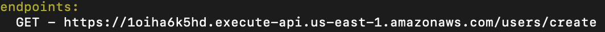

function will be store in Amazon database, whenever a function need to be called, Amazon find this function in database and put it into containers, and provide each user a container.

Because it is stored in database, when it first runs a function, it takes a little bit of time. (like we build docker container)

Amazon only charge when it runs

# Serverless

Serverless will take care of all the aws configuration for us

```bash
npm install serverless
```

```bash
serverless create --help
```

Note: we can use "sls" as a short hand of "serverless"


```bash
sls create -t aws-nodejs
```

-t: template

Three file will be generated:


## IAM(Identity and Access Management)

1. Go to aws search IAM service
2. Add new user
3. Give user permission(AdministratorAccess for now)


```bash
sls config credentials --provider aws --key [Access key ID] --secret [Secret access key]
```

The command above create a folder under root folder:  `~/.aws` and create a file `credentials` contains the access key ID and secret

```bash
cd ~/.aws
nano credentials
```


## serverless.yml

```yaml
#blahblah
service: awsTest
provider:
  name: aws
  runtime: nodejs12.x
  lambdaHashingVersion: 20201221

  # you can overwrite defaults here
  #  stage: prod
  stage: dev
  
functions:
  test:
    handler: handler.test
#blahblah
```


## handler.js

stateless function, not store any data

```js
"use strict";

module.exports.test = async (event) => {
  return {
    statusCode: 200,
    body: JSON.stringify(
      {
        message: "Go Serverless v1.0! Your function executed successfully!",
        input: event,
      },
      null,
      2
    ),
  };
```


```bash
sls deploy
```


```bash
sls invoke --function [function name]
```


We can add a "local" `sls invoke local --function [function name]` which try and simulate the lambda function and run locally so that we won't get charged. 

## serverless.yml

```yaml
#blahblah
functions:
  test:
    handler: handler.test
    events:
      - httpApi:
          path: /users/create
          method: get
#blahblah
```

After `sls deploy`, we have an endpoint:



which can be access by http request:


# use parameters

## handler.js


# Resources:

## IAM

To learn more about IAM policies, you can check out [the official documentation from Amazon](https://docs.aws.amazon.com/IAM/latest/UserGuide/access_policies_manage.html), or [this documentation](https://serverless.com/framework/docs/providers/aws/guide/iam/) from the Serverless framework

