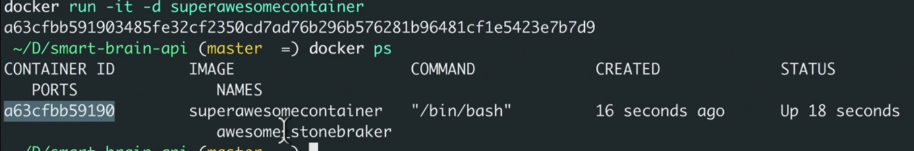

-t: add a tag

.: into current directory

```bash
 docker build -t superawesomecontainer .
 docker run -it superawesomecontainer
```

-it: give us TTY environment


"cf26f2005fbc": hash generatered by docker to identify different containers


Now we have the node with version we need.

```bash
 run -it -d superawesomecontainer
```

-d: run on the background

```bash
docker ps
```

Show all container running:



```bash
 docker exec -it a63cfbb59190 bash
```

above to enter the container again

```bash
 docker stop a63cfbb59190
```

```bash
docker run -it p 3000:3000 superawesomecontainer
```

above bind the port 3000 of the container to the machine port 3000, so that on machine brwoser we can launch the app in the container (with port 3000)

# resource:

More docker commands: https://docs.docker.com/engine/reference/builder/#usage