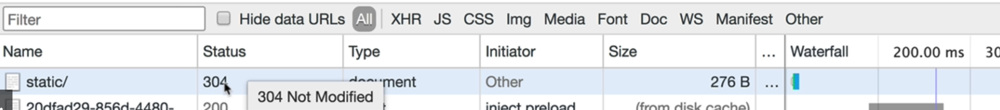

**CPU** is built with a special on chip memory called Registers. They're the closest and smallest memory storage in our computers, but also the fastest sometimes you may have heard of these registers as L. zero cash, 11 cash, L3, L4, cash.

**RAM** (Random Access Memory) As soon as the power goes off of our computers, well, that information is gone. But because it is a memory, well, it's also fast to access.

**Hard Disk Drive**: physical disks in computer. It has to travel a longer distance and the disk takes a longer time to give that information to the CPU. But the added benefit is that even if the power goes off, this disk will remember our information.

Caching everywhere:

CDN caching, Browser caching, Server caching, Database caching

## Browser caching

# Cach Busting

After we update the code. And because it's from cash, it won't know that the changes have been made, and while my website is completely different, they my view an older version of the website.

Webpack automatically does this for us. If we change the file, the file name will be different so that browser will redownload the file.

Before:

After we modify the css file and save:

# Server Caching

Cloud services like GitHub pages can automatically handle the caching for us. If we own the server ourselves, we can do it manully:

max-age: how many seconds do you want the browser to remember this data that we're sending it?

ETag: browser makes request to my server express server to ask if the file has changed, if it hasn't changed, the ETag should be the same and use whatever in the cash(304 Not Modified), if changed, server will give a new ETag to the file and send to browser(200).

Old and new way to implement cach:

# Resources:

To learn more about how caching works and the two headers we discussed in the previous videos: Etag and Cache Control, I recommend you read further using these resources:

1. [Caching Everywhere](https://medium.freecodecamp.org/the-hidden-components-of-web-caching-970854fe2c49)

2. [Cache Headers](https://developers.google.com/web/fundamentals/performance/optimizing-content-efficiency/http-caching)

3. [Caching and Performance](https://devcenter.heroku.com/articles/increasing-application-performance-with-http-cache-headers)