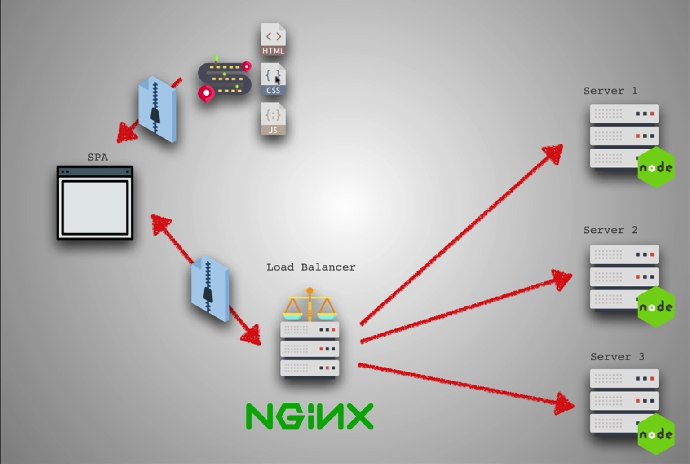

# Load Balancing

load balancing, as the name suggests, is a way for us to balance multiple requests at the same time and distribute them to different services.

Nginx is a reverse proxy to serve static files

Most common way to loadbalancing is use services provided by AWS, DigitalOcean etc. Uncommon to code load balancer by ourselves, which is below:

