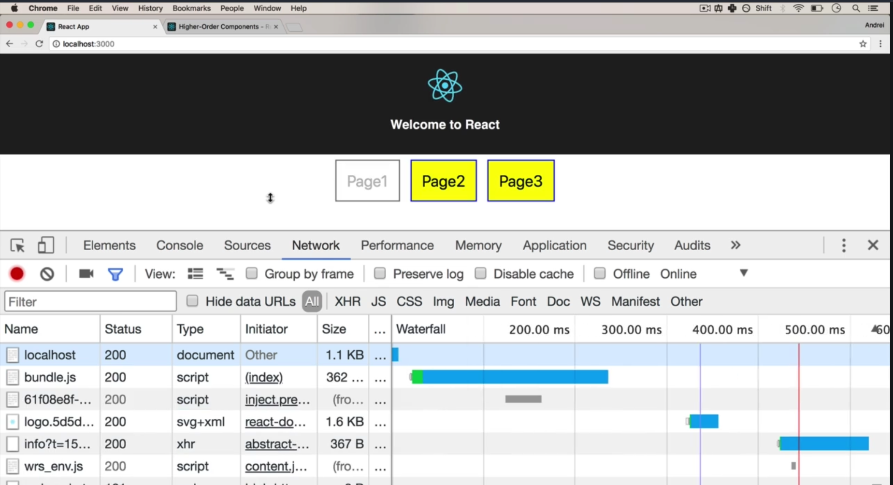
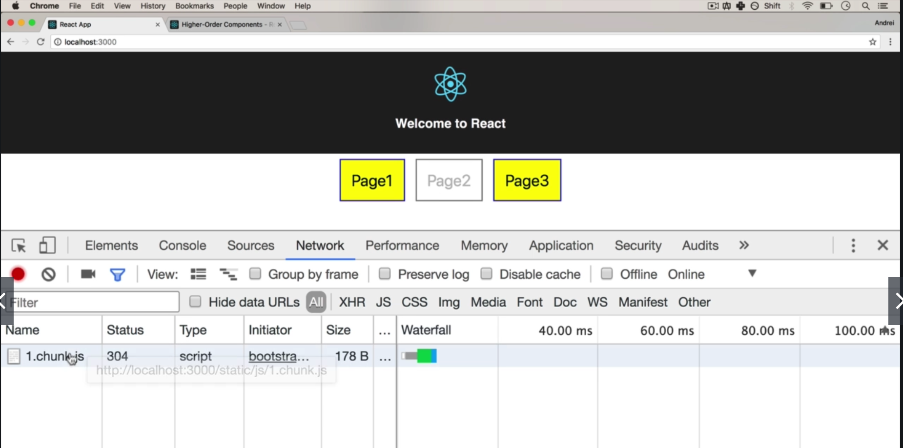
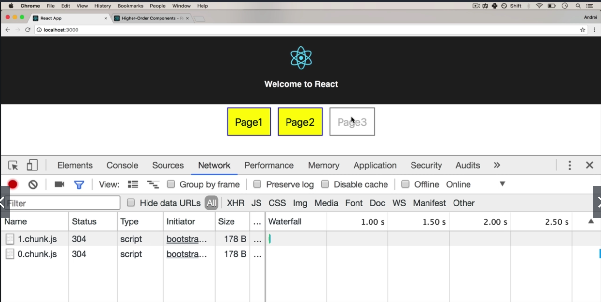

## **[official code splitting documentation from React](https://reactjs.org/docs/code-splitting.html)**


Thre red JS file is a vendor JS file, with all of the third party libraries in it, to be loaded through every page.

### Example layout

Initial:



Click "Page 2" Button:



Click " Page 3" Button:



**Note: When implementing code splitting, after click Page 2 and Page 3 button, the page will have a quick flash because it needs a little time to load JS file for Page 2 and Page 3. This is a trade off, needs to be considered**

And:  `npm run build` after implementing Part 3:


The main bundle will increase because we have a new component to import : AsyncComponent.js. That is also a trade off.

(0.xxxx.chunk.js and 1.xxxxx.chunk.js are the two chunk JS file for Page 2 and Page 3)

# Code:

Part 1 - No code splitting

Part 2 - Code Splitting - manual

Part 3 - Cleaner Code Splitting

Part 4 - React.Lazy

### App.js (Part 1,2,3,4)

```react
import React, { Component, Suspense } from 'react';
import './App.css';

import Page1 from './Components/Page1';
// Part 1 - No Code Splitting 
// import Page2 from './Components/Page2';
// import Page3 from './Components/Page3';

// Part 3 - Cleaner Code Splitting
// import AsyncComponent from './AsyncComponent';

// Part 4 - React.lazy
const Page2Lazy = React.lazy(() => import('./Components/Page2'));
const Page3Lazy = React.lazy(() => import('./Components/Page3'));

class App extends Component {
  constructor() {
    super();
    this.state = {
      route: 'page1',
      // Part 2 - Code Splitting - manual
      // component: null
    }
  }
  onRouteChange = (route) => {
    // Part 1 - No Code Splitting
    this.setState({ route: route });
    // Part 2 - Code Splitting - manual
    // if (route === 'page1') {
    //   this.setState({ route: route })
    // } else if (route === 'page2') {
    //   import('./Components/Page2')
    //     .then((Page2) => {
    //       this.setState({ route: route, component: Page2.default })
    //     })
    //     .catch(err => {
    //     });
    // } else {
    //   import('./Components/Page3')
    //     .then((Page3) => {
    //       this.setState({ route: route, component: Page3.default })
    //     })
    //     .catch(err => {
    //       console.log(err)
    //     });
    // }
  }
  render() {
    // Part 1 - No code splitting
    // if (this.state.route === 'page1') {
    //   return <Page1 onRouteChange={this.onRouteChange} />
    // } else if (this.state.route === 'page2') {
    //   return <Page2 onRouteChange={this.onRouteChange} />
    // } else {
    //   return <Page3 onRouteChange={this.onRouteChange} />
    // }

    // Part 2 - No Code Splitting - manual
    // if (this.state.route === 'page1') {
    //   return <Page1 onRouteChange={this.onRouteChange} />
    // } else {
    //   return <this.state.component onRouteChange={this.onRouteChange} />
    // }

    // Part 3 - Cleaner Code Splitting
    // if (this.state.route === 'page1') {
    //   return <Page1 onRouteChange={this.onRouteChange} />
    // } else if (this.state.route === 'page2') {
    //   const AsyncPage2 = AsyncComponent(() => import("./Components/Page2"));
    //   return <AsyncPage2 onRouteChange={this.onRouteChange} />
    // } else {
    //   const AsyncPage3 = AsyncComponent(() => import("./Components/Page3"));
    //   return <AsyncPage3 onRouteChange={this.onRouteChange} />
    // }

    // Part 4 - React.Lazy
    if (this.state.route === 'page1') {
      return <Page1 onRouteChange={this.onRouteChange} />
    } else if (this.state.route === 'page2') {
      return (
        <Suspense fallback={<div>Loading...</div>}>
          <Page2Lazy onRouteChange={this.onRouteChange} />
        </Suspense>
      );
    } else {
      return (
        <Suspense fallback={<div>Loading...</div>}>
          <Page3Lazy onRouteChange={this.onRouteChange} />
        </Suspense>
      );
    }

  }
}

export default App;

```

### AsyncComponent.js (Part 3)

```react
import React, { Component } from "react";

export default function asyncComponent(importComponent) {
  class AsyncComponent extends Component {
    constructor(props) {
      super(props);
      this.state = {
        component: null
      };
    }

    async componentDidMount() {
      const { default: component } = await importComponent();

      this.setState({
        component: component
      });
    }

    render() {
      const Component = this.state.component;

      return Component ? <Component {...this.props} /> : null;
    }
  }

  return AsyncComponent;
}
```

### Route-based code splitting vs Component-based code splitting

## Tools:

[React-Loadable](https://github.com/jamiebuilds/react-loadable) A useful library for component-based code splitting

