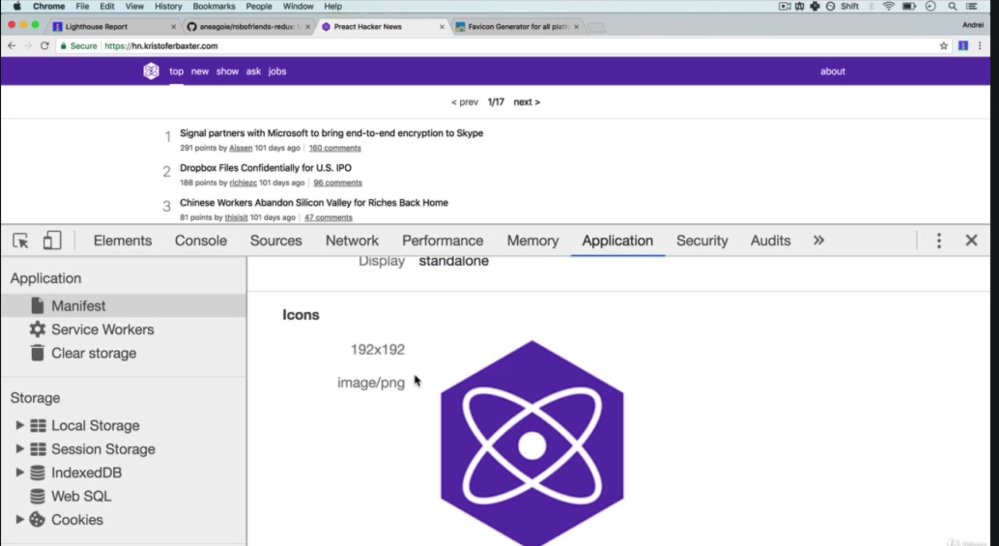

# App Manifest

**Note: Remember to put this into HTML file:**

```html
<head>
	<meta name="viewport" content="width=device-width, initial-scale=1, shrink-to-fit=no">  
</head>
```

This will adjust the content base on the device's screen size.

`create-react-app`will automatically generate the `manifest.json`file.

### Manifest.json

## 

## Icons



[Real Favicon Generator](https://realfavicongenerator.net/): a tool to generate favicon from an image. It can also preview or customize the splash screen file.

### Resources:

To learn more, have a look at [Viewport Meta Tag](https://developers.google.com/web/tools/lighthouse/audits/has-viewport-meta-tag)