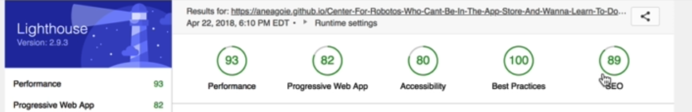

**Note: Performance score will depend on your internet speed.**

## 1

Use swap to show user the default text without the special font until the font is fully loaded:

## 2

Add an aria-label to let screen reader tell user this is a field to search robots

## 3

## 4, 5

Use [Real Favicon Generator](https://realfavicongenerator.net/) to generate favicon and splash screen.

### index.html

### manifest.json

And add other icon like above.....

## Resources

You can find the solution Github repository at [**https://github.com/aneagoie/robofriends-pwa**](https://github.com/aneagoie/robofriends-pwa)

Or the latest updates included (package.json update) repository at:

[**https://github.com/aneagoie/Center-For-Robotos-Who-Cant-Be-In-The-App-Store-And-Wanna-Learn-To-Do-Other-Stuff-Good-Too-update**](https://github.com/aneagoie/Center-For-Robotos-Who-Cant-Be-In-The-App-Store-And-Wanna-Learn-To-Do-Other-Stuff-Good-Too-update)

Finally, I would like to share with you this resource to finish off this section. It is a website that lists all tools that you can use to improve front end performance of your web app: https://progressivetooling.com/