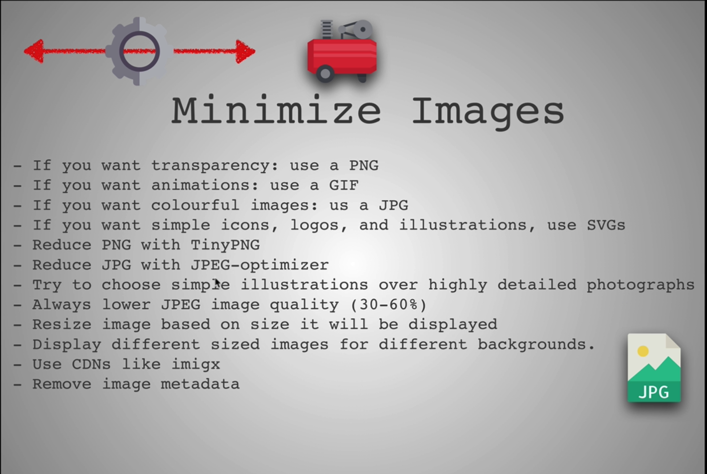

Minimize Text tool: UglifyJS, MinifyJS

|  | Minimize Image |
| -------------- | ------------------------------------------------------------ |
| JPG            | photos, complex images with many colors, not allowed transparency, large |
| GIF            | allow transparency, reduced color count, good for small animations |
| PNG            | allow transparency, limited color, use for logos, smaller than JPG |
| SVG            | vector graphics, usually work with tools like illustrator, sketch etc. Can be expand larger with a sharp and as clear as original image. Incredibly small size. Can be customized using css. Usually tend to be very simplistic visual things with few colors. |

https://99designs.com/blog/tips/image-file-types/

https://pageweight.imgix.com/

https://www.sitepoint.com/gif-png-jpg-which-one-to-use/

https://www.verexif.com/en/

[Media Queries](https://css-tricks.com/snippets/css/media-queries-for-standard-devices/)

[Media Queries Cheat Sheet](https://gist.github.com/bartholomej/8415655)

