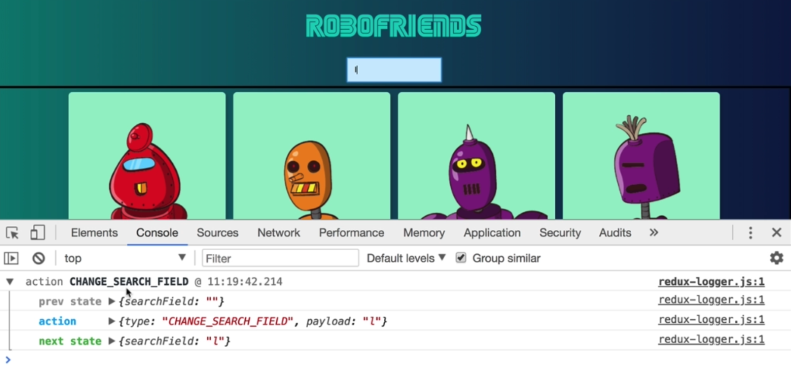

For debugging purpose

`$npm install redux-logger`

# Index.js

```react
import { applyMiddleware } from 'redux'
import { createLogger } from 'redux-logger'

const logger = createLogger;
//was: const sotre = createStore(searchRobots)
//change to: 
const store = createStore(searchRobots, applyMiddleware(logger));
```



Now when typing in search field, console will show redux state.

# Additional:

### Redux DevTools

A more powerful way to monitoring Redux during coding process.

