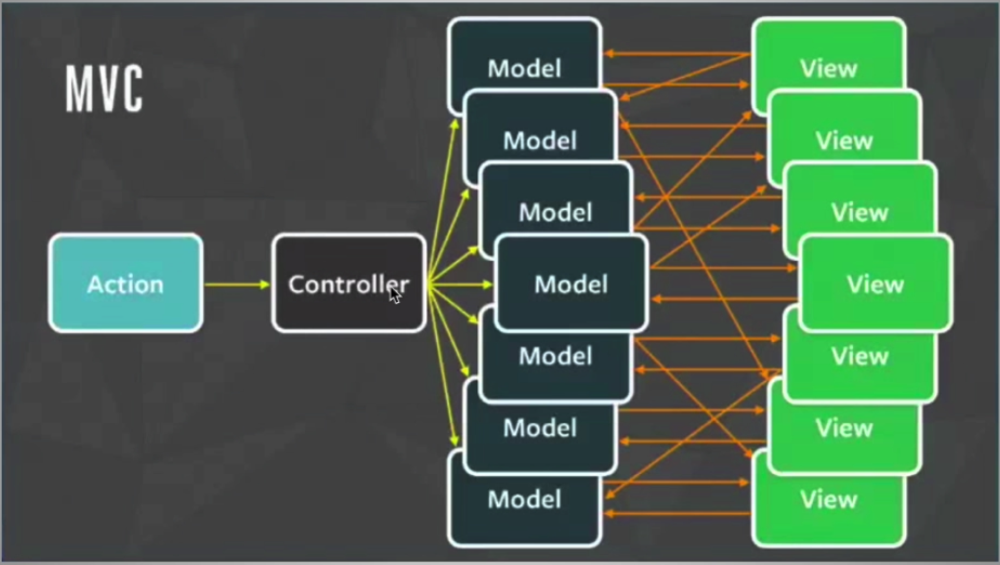

# Redux

The concept is mimic the way we design database:  There are many users simutanously read or modify database, we need a way to avoid bugs and errors.

### Flux Pattern vs MVC Pattern: 

#### Without Redux:

(Blue dots trigger the state change and make the tree rerender)

#### With Redux:

# Install Redux

`$npm install redux`

`$npm install react-redux`

**Note: Try using "Redux Toolkit" to simplify the boilerplate redux code**

**Note: Yellow dots is components that implemented connect() function of Redux**

