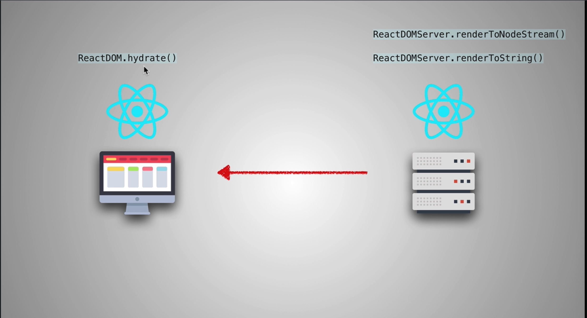
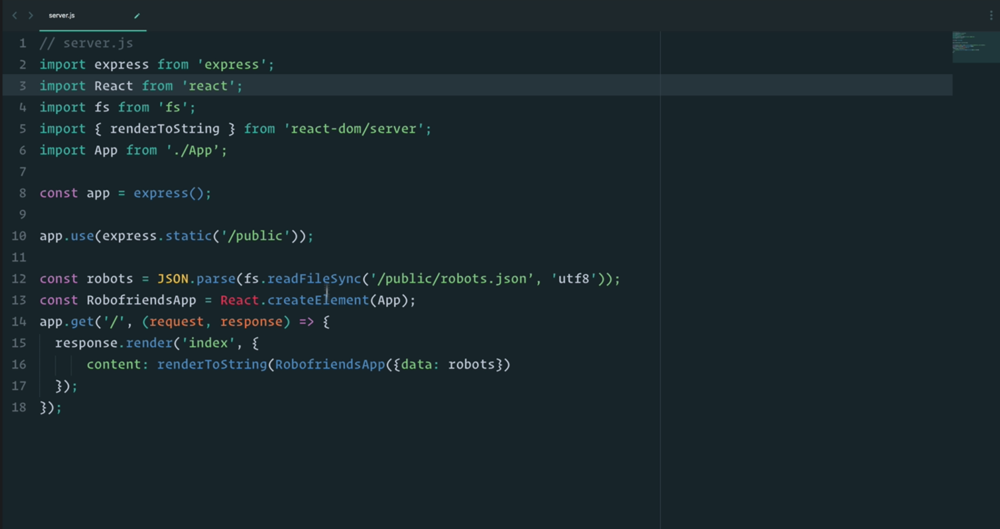

# React Server Side Rendering

On server side, `renderToString()` convert react app into a string and send through the wire to client side. On client side, `hydrate()` attach event listeners so that user can interact with the page.

`renderToNodeStream()` is a new function similar to `renderToString()` on ReactDOMServer that makes the process more faster.

