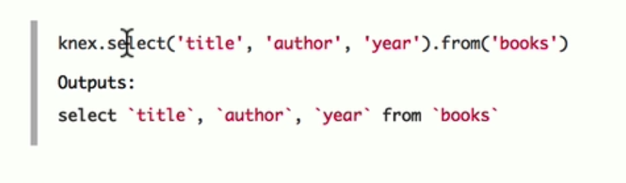

# Injections

Most important topic, covers almost 50% of security issues

### SQL Injections

```sql
' or 1-1--
'; DROP TABLE users; --
```

### HTML Injections

Put some html code into input of html page. i.e. scripts

## Solution:

1. Sanitize input

2. Parametrize Queries

   ```js
   function sqlSelect(name, email, id) {
   	if( name === number){
   		...
   	}
   }
   ```

3. Knex.js or other ORMS



#### Resource:

[SQL Injection](https://www.hacksplaining.com/exercises/sql-injection)