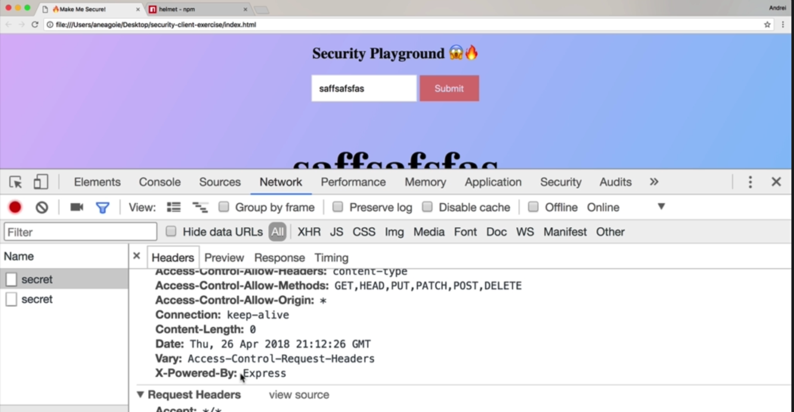

```shell
npm install helmet
```

Before using helmet:



We can see headers like X-Powered-By: Express. Then people would know that our server is built with express

After we using helmet


Helmet will create all the securtity headers for us:


Now we have all the guards for us.

And we don't need to add headers like below by ourselves:


# Resources:

1. If you are new to HTTP: https://code.tutsplus.com/tutorials/http-the-protocol-every-web-developer-must-know-part-1--net-31177
2. To learn a little bit more about HTTP Headers: https://developer.mozilla.org/en-US/docs/Web/HTTP/Headers
3. HTTP Header Fields: https://www.tutorialspoint.com/http/http_header_fields.htm
4. Helmet package documentation: https://github.com/helmetjs/helmet

